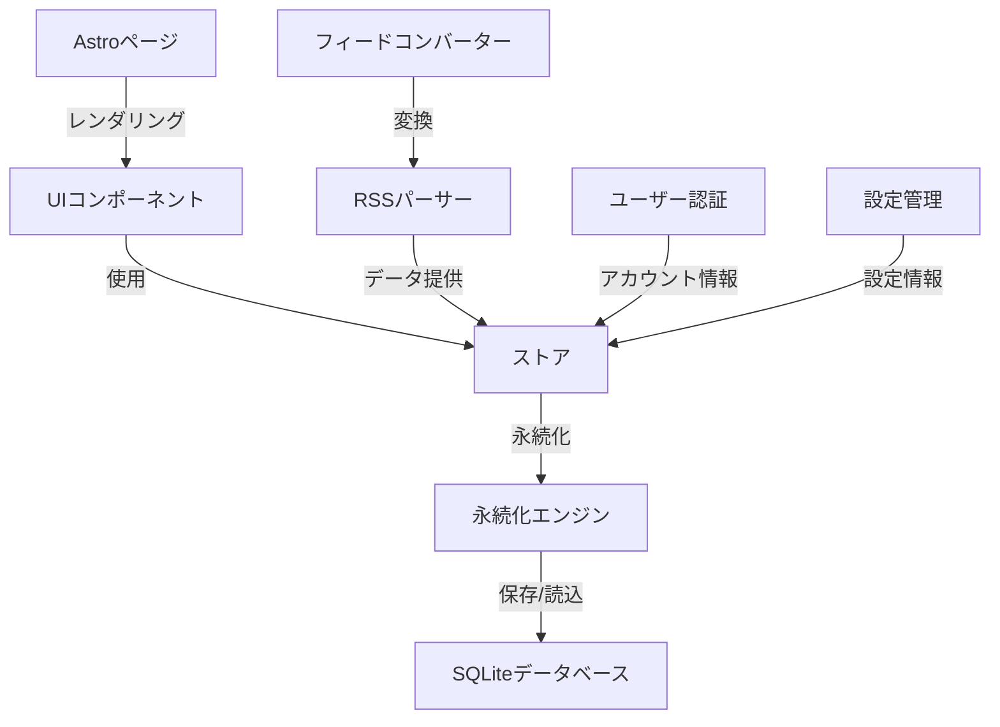
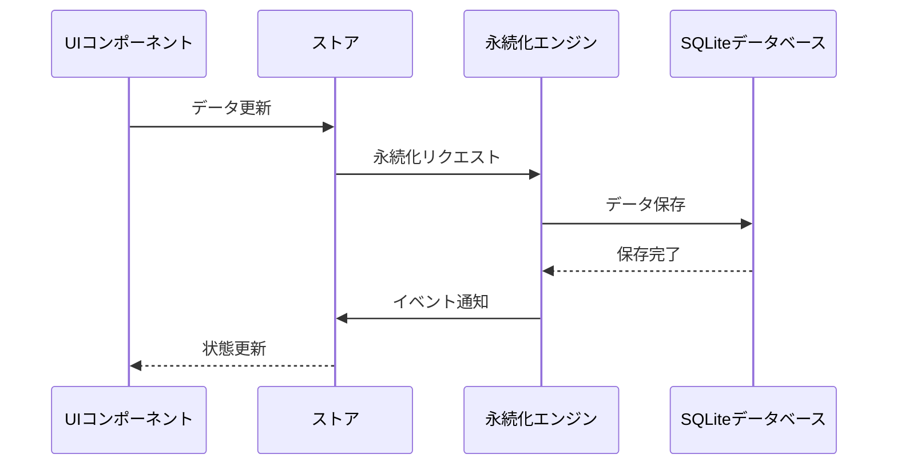
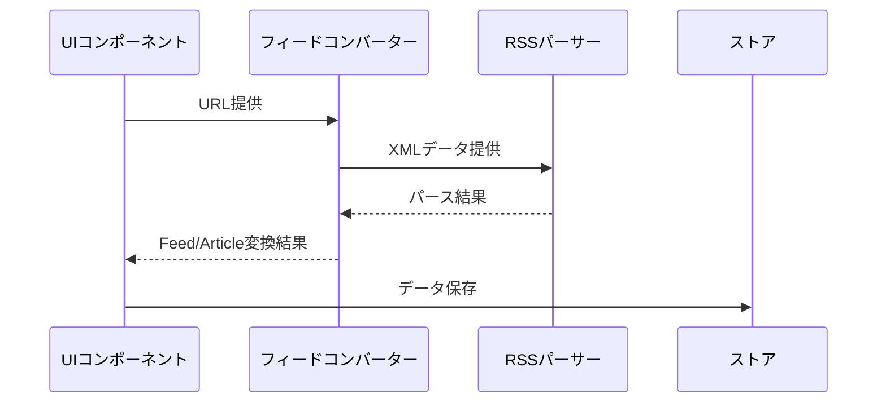

# システムパターン: Astro RSS Reader

## アーキテクチャ概要

Astro RSS Readerは、以下の主要コンポーネントで構成されています：

## 主要コンポーネント

### 1. UIコンポーネント (src/components/)

- **役割**: ユーザーインターフェースの構築
- **特徴**: Astroコンポーネントとして実装され、HTMLとCSSを中心に構成
- **パターン**: コンポーネントベースの設計、関心の分離

### 2. ストア (src/store/)

- **役割**: アプリケーションの状態管理
- **特徴**: nanostores/persistentを使用した永続的な状態管理
- **パターン**: アトミックデザイン、イベント駆動型アーキテクチャ

### 3. 永続化エンジン (src/store/index.ts)

- **役割**: アカウントごとのデータ分離と永続化
- **特徴**: カスタムProxyを使用したnanostores/persistentの拡張
- **パターン**: プロキシパターン、ファサードパターン

### 4. データベース (src/features/persistence/persistence.ts)

- **役割**: データの永続的な保存
- **特徴**: SQLiteを使用したキー・バリューストア
- **パターン**: リポジトリパターン、データアクセスオブジェクト

### 5. RSSパーサー (src/features/feed/rss-parser.ts)

- **役割**: RSSフィードのXMLをパースしてJavaScriptオブジェクトに変換
- **特徴**: fast-xml-parserを使用したXML解析
- **パターン**: アダプターパターン、ファクトリーパターン

### 6. フィードコンバーター (src/features/feed/feed-converter.ts)

- **役割**: RSSフィードをアプリケーションのデータモデルに変換
- **特徴**: URLからフィードを取得し、Feed型とArticle型に変換
- **パターン**: アダプターパターン、マッパーパターン

## 設計パターン

### 1. コンポーネントベースの設計

- **説明**: UIを再利用可能なコンポーネントに分割
- **利点**: 再利用性、保守性、テスト容易性の向上
- **実装**: Astroコンポーネント（.astroファイル）とCSSコンポーネント（styles/components/）

### 2. イベント駆動型アーキテクチャ

- **説明**: コンポーネント間の通信をイベントで行う
- **利点**: 疎結合、スケーラビリティの向上
- **実装**: nanostoresのサブスクリプションとイベントリスナー

### 3. リポジトリパターン

- **説明**: データアクセスロジックをビジネスロジックから分離
- **利点**: データソースの抽象化、テスト容易性の向上
- **実装**: persistence.tsのsave/load/remove関数

### 4. アダプターパターン

- **説明**: 異なるインターフェースを持つクラスを連携させる
- **利点**: 既存のコードを変更せずに新しいインターフェースを使用可能
- **実装**: RSSパーサーとフィードコンバーター

### 5. プロキシパターン

- **説明**: オブジェクトへのアクセスを制御するためのラッパー
- **利点**: アクセス制御、遅延初期化、ロギングなどの追加機能
- **実装**: カスタム永続化エンジンのProxyオブジェクト

## コンポーネントの関係

### データフロー

### フィード取得フロー

## モジュール構造

プロジェクトは以下のモジュール構造に従っています：

- **src/components/**: UIコンポーネント
  - **feeds/**: フィード関連のコンポーネント
  - **home/**: ホームページ用コンポーネント
  - **layouts/**: レイアウト関連のコンポーネント
  - **settings/**: 設定画面用コンポーネント
- **src/features/**: 機能モジュール
  - **feed/**: フィード処理関連の機能
  - **persistence/**: データ永続化の機能
- **src/store/**: データストア
  - **accounts.ts**: アカウント管理
  - **articles.ts**: 記事管理
  - **settings.ts**: 設定管理
  - **index.ts**: 永続化エンジン
- **src/styles/**: CSSスタイル
  - **base/**: 基本スタイル
  - **components/**: コンポーネントスタイル
  - **tokens/**: デザイントークン
  - **utilities/**: ユーティリティクラス
- **src/types/**: TypeScript型定義
  - **account.ts**: アカウント関連の型
  - **article.ts**: 記事関連の型
  - **feed.ts**: フィード関連の型
  - **user.ts**: ユーザー関連の型

## 重要な技術的決定

1. **Astroフレームワークの採用**

   - **理由**: パフォーマンス、HTML/CSS/JSの分離、シンプルなコンポーネントモデル
   - **影響**: サーバーサイドレンダリング、最小限のJavaScript、高速な初期ロード

2. **CSSコンポーネントの活用**

   - **理由**: JSフレームワークに依存しないデザインシステム、関心の分離
   - **影響**: 軽量なUI、スタイルの一貫性、メンテナンス性の向上

3. **SQLiteの使用**

   - **理由**: シンプルな設定、サーバーレス、十分なパフォーマンス
   - **影響**: オフラインサポート、データの永続化、シンプルなデータモデル

4. **nanostores/persistentの採用**

   - **理由**: 軽量、型安全、永続化サポート
   - **影響**: リアクティブな状態管理、データの自動永続化

5. **Zodによるスキーマ定義**
   - **理由**: 型安全性、ランタイムバリデーション、スキーマ駆動開発
   - **影響**: 堅牢なデータモデル、エラーの早期検出、自己文書化コード
