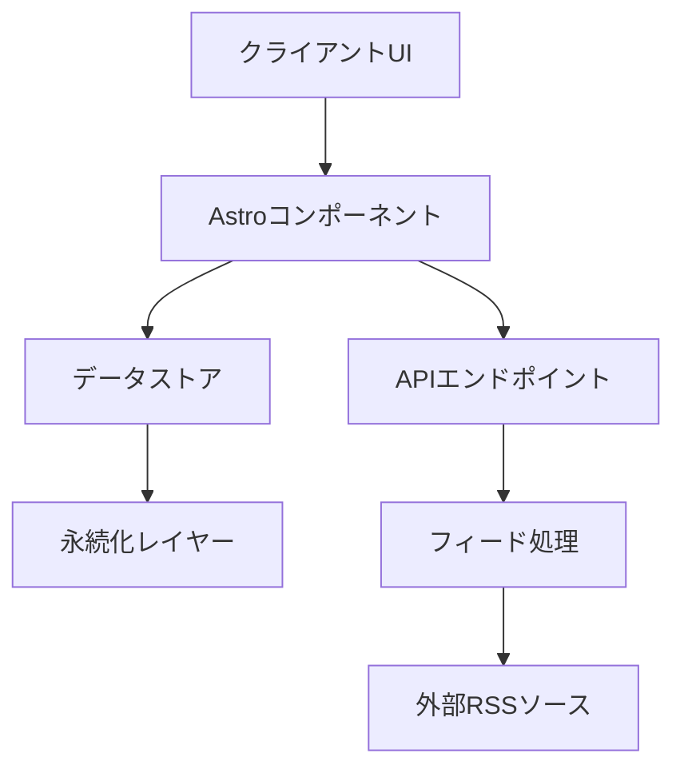

# Astro RSS Reader システムパターン

## アーキテクチャ概要

Astro RSS Readerは、Astroフレームワークを基盤とした、モダンなウェブアプリケーションです。アーキテクチャは以下の主要コンポーネントで構成されています：



## コアコンポーネント

### 1. UI層
- **Astroコンポーネント**: `.astro`ファイルで実装された、ページとUIコンポーネント
- **スタイリング**: CSSモジュールとトークンベースのデザインシステム
- **レイアウト**: レスポンシブデザインを実現するフレキシブルなレイアウトシステム

### 2. データ管理
- **ストア**: nanostoresを使用した状態管理
- **永続化**: SQLiteを使用したローカルストレージ
- **型安全性**: Zodによるスキーマ検証

### 3. フィード処理
- **パーサー**: fast-xml-parserを使用したRSS/Atomフィードの解析
- **コンバーター**: 外部フィードデータを内部モデルに変換
- **キャッシュ**: パフォーマンス向上のためのフィードデータキャッシュ

### 4. API層
- **エンドポイント**: AstroのファイルベースルーティングによるAPI
- **アクション**: Astroアクションによるサーバーサイド処理
- **プロキシ**: CORSを回避するためのプロキシ機能

## 設計パターン

### 1. モジュール分割パターン
プロジェクトは機能ごとにモジュール化されており、各モジュールは独自の責任を持ちます：

- **features/**: コアビジネスロジック（フィード処理、永続化など）
- **components/**: UI構成要素
- **pages/**: ルーティングとページレイアウト
- **types/**: 型定義
- **store/**: 状態管理
- **styles/**: デザインシステム

### 2. アダプターパターン
外部依存（RSSフィード、ストレージなど）は抽象化され、交換可能なインターフェースを通じてアクセスされます：

```typescript
// 抽象インターフェース
interface FeedSource {
  getFeed(url: string): Promise<Feed>;
}

// 具体的な実装
class RssFeedSource implements FeedSource {
  async getFeed(url: string): Promise<Feed> {
    // 実装...
  }
}
```

### 3. ファクトリーパターン
複雑なオブジェクトの作成は専用のファクトリー関数に委譲されています：

```typescript
// 記事オブジェクトの作成
export function NewArticle({...}): Article {
  return {
    id: id as ArticleId,
    // その他のプロパティ...
  };
}
```

### 4. リポジトリパターン
データアクセスはリポジトリパターンを通じて抽象化されています：

```typescript
// 永続化レイヤー
export function save(key: string, value: string): void {
  // SQLiteへの保存実装...
}

export function load(key: string): string | undefined {
  // SQLiteからの読み込み実装...
}
```

## データフロー

1. **フィード購読**:
   ```
   ユーザー入力 → フィードURL検証 → フィード取得 → パース → 変換 → 保存
   ```

2. **記事閲覧**:
   ```
   ページロード → ストアからデータ取得 → フィルタリング → レンダリング
   ```

3. **設定変更**:
   ```
   ユーザー入力 → 設定ストア更新 → 永続化 → UI更新
   ```

## 技術的決定

### 1. Astroの採用
- **理由**: 高速なパフォーマンス、最小限のJavaScript、ファイルベースルーティング
- **トレードオフ**: 一部のインタラクティブ機能の実装が複雑化

### 2. SQLiteの使用
- **理由**: シンプルで堅牢なローカルストレージ、サーバーレス運用
- **トレードオフ**: 複雑なクエリやリレーショナルデータモデルのサポートが限定的

### 3. nanostoresの採用
- **理由**: 軽量で効率的な状態管理、TypeScriptとの統合
- **トレードオフ**: 大規模なアプリケーション状態管理には機能が限定的

### 4. CSSモジュールとトークンベースデザイン
- **理由**: コンポーネントのスタイル分離、一貫性のあるデザインシステム
- **トレードオフ**: 追加のビルド設定、学習曲線

## コンポーネント関係

### UI構造
```
Layout
├── Head
├── Side (ナビゲーション)
└── Main Content
    ├── FeedHeader
    ├── ArticleFilters
    ├── ArticleCard
    └── ArticlePreview
```

### データフロー
```
nanostores (状態)
├── settings (ユーザー設定)
├── accounts (ユーザーアカウント)
└── users (ユーザー情報)
```

## 拡張性と保守性

1. **モジュール化**: 機能ごとに分離されたモジュールにより、拡張と保守が容易
2. **型安全性**: TypeScriptとZodによる厳格な型チェックで、バグを早期に発見
3. **テスト**: ユニットテストによる機能の検証
4. **ドキュメント**: コードコメントとドキュメントによる知識の共有
5. **設計原則**: 単一責任の原則、関心の分離、DRY原則の遵守
