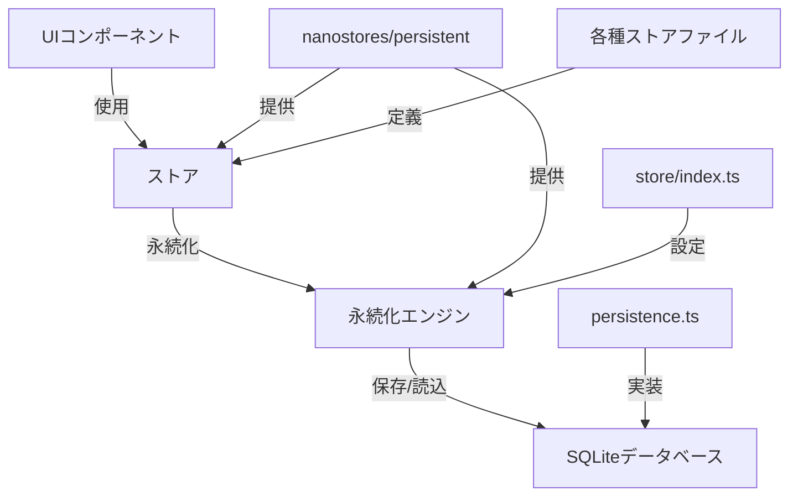
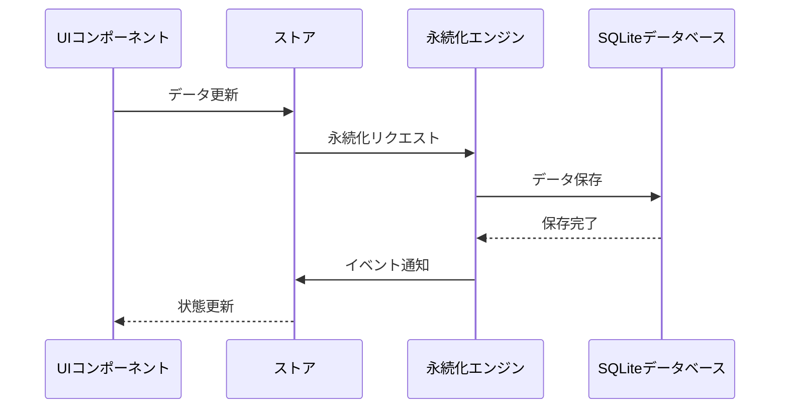

# データ管理システム

このドキュメントでは、Astro RSSリーダーアプリケーションのデータ管理システムについて説明します。

## 概要

このアプリケーションのデータ管理システムは、以下の主要コンポーネントで構成されています：

1. **nanostores/persistent** - 状態管理と永続化のためのライブラリ
2. **カスタム永続化エンジン** - アカウントごとのデータ分離を実現
3. **SQLiteデータベース** - 実際のデータ保存先



## 主要コンポーネント

### 1. 永続化エンジン (src/store/index.ts)

永続化エンジンは、`nanostores/persistent`のカスタム実装です。このエンジンは：

- アカウントごとのデータ分離を実現
- イベント通知システムを実装
- データの保存、読み込み、削除の操作を提供

```typescript
// 使用例
import { setAccountStorage } from "~/store";

// アカウントIDを指定して永続化エンジンを初期化
setAccountStorage("user123");
```

### 2. 永続化機能 (src/features/persistence/persistence.ts)

永続化機能は、SQLiteデータベースを使用してデータを保存するします。この機能は：

- スコープ（アカウント）ごとのデータ管理
- キー・バリューストアとして実装
- JSONオブジェクトとしてデータを保存

```typescript
// 内部実装の概要
// 1. スコープ（アカウントID）ごとにJSONオブジェクトを保存
// 2. キーはJSONオブジェクト内のプロパティとして保存
// 3. 値はJSON文字列として保存
```

### 3. 各種ストア

#### アカウント管理 (src/store/accounts.ts)

#### 記事管理 (src/store/articles.ts)

#### 設定管理 (src/store/settings.ts)

## データフロー

1. UIコンポーネントがストアを使用してデータを読み書き
2. ストアは`nanostores/persistent`を通じて永続化エンジンにデータを渡す
3. 永続化エンジンは`persistence.ts`の関数を使ってSQLiteにデータを保存
4. データ変更時にイベントが発火し、リスナーに通知



## 使用方法

### 1. 永続化エンジンの初期化

アプリケーションの起動時に、現在のアカウントIDを使用して永続化エンジンを初期化する

```typescript
import { setAccountStorage } from "~/store";

// ログイン後やアプリ起動時
setAccountStorage(currentAccountId);
```

### 2. ストアの使用

各ストアは`persistentAtom`を使用して定義されており、通常のnanostoresのアトムと同様に使用可能

```typescript
import { $settings } from "~/store/settings";

// 読み取り
const currentSettings = $settings.get();

// 更新（自動的に永続化される）
$settings.set({
  ...currentSettings,
  appearance: {
    ...currentSettings.appearance,
    theme: "dark",
  },
});
```

### 3. カスタムアクションの使用

各ストアには、一般的な操作を簡単に行うためのカスタムアクションが用意されています

```typescript
import { updateArticleStatus } from "~/store/articles";
import { ArticleStatus } from "~/types/article";

// 記事を既読に設定
updateArticleStatus("article123", ArticleStatus.READ);
```

## アーキテクチャの利点

1. **アカウント分離** - 各アカウントのデータは分離されている
2. **型安全** - TypeScriptの型システムを活用
3. **リアクティブ** - データ変更時に自動的にUIが更新
4. **永続化** - データはSQLiteに自動的に保存
5. **シンプルなAPI** - 使いやすいインターフェース

## 注意点

1. **大量データ** - 大量のデータを保存する場合は、パフォーマンスに注意
2. **同期処理** - 現在の実装は同期的なので、大きなデータセットでは注意が必要
3. **エラー処理** - データベース操作のエラー処理を適切に行う必要がある

## 拡張方法

新しいストアを追加する場合は、以下の手順に従う：

1. `src/store/`に新しいファイルを作成
2. `persistentAtom`を使用してストアを定義
3. 必要に応じてカスタムアクションを実装

```typescript
// 例: src/store/favorites.ts
import { persistentAtom } from "@nanostores/persistent";
import type { ArticleId } from "~/types/article";

// お気に入り記事のIDを管理するストア
export const $favorites = persistentAtom<ArticleId[]>("favorites", [], {
  encode: JSON.stringify,
  decode: JSON.parse,
});

// お気に入りに追加
export function addFavorite(articleId: ArticleId): void {
  const favorites = $favorites.get();
  if (!favorites.includes(articleId)) {
    $favorites.set([...favorites, articleId]);
  }
}

// お気に入りから削除
export function removeFavorite(articleId: ArticleId): void {
  const favorites = $favorites.get();
  $favorites.set(favorites.filter((id) => id !== articleId));
}
```
